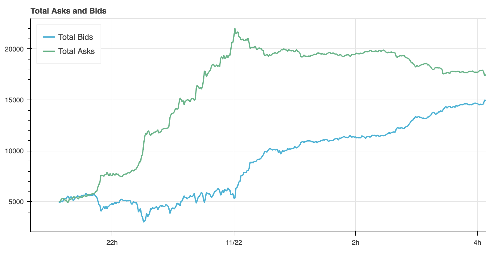

# Automated Crypto Trading System (ACTS)

In the last couple of years, I have built and maintained an automated trading system for a hedge fund that traded
Futures contracts on major stock exchanges around the world. While I can’t share the details of this trading system
publicly, I would like to use these series of article to demonstrate how to build an automated trading system from
scratch for crypto assets.

Here is a high-level overview of what we are going to cover:

1. Real-time data collection system
2. Historical data processing
3. Backtesting & reporting
4. Unit and integration testing
5. Live trading

## Real-time data collection system

The first system we are going to build is a real-time data collection system.
This system will collect data from the order book in near real-time,
such that a trading strategy can calculate buy/sell signals in a timely fashion.
Any trading strategy will need to collect some features from the order book, so let's talk about it briefly.

### Order book

An order book is a fundamental concept in financial trading,
representing a list of buy and sell orders for a specific financial instrument,
like a stock, currency, or cryptocurrency.

The key components of an order book are bids and asks.
A "bid" is an offer to buy a financial instrument at a specific price.
It represents the highest price a buyer is willing to pay.
On the other side, an "ask" is an offer to sell at a specific price.
It represents the lowest price a seller is willing to accept.

The difference between the highest bid and the lowest ask is known as the "spread."
A smaller spread often indicates a more liquid market, meaning there are many buyers and sellers,
and it's easier to execute a trade at a price close to the market value.

Here is a bar plot visualization of an order book for bitcoin that illustrates those concepts:


The height of each bar is the amount of orders at this particular price.
Bitcoin in very liquid, so both the lowest ask and the highest bid are very close.
You can also notice the many peaks on both asks and bids sides of the book.
This is what people refer to as a support/resistance price levels of an asset.
Since there are so many orders at these levels, it is difficult for asset price to move beyond in case of market movements.

### Data types

Let’s define the data we would like to collect:

- **Prices**. Any sort of strategy would probably need actual asset prices, so we need to collect at least best bid (
  highest buy) and best ask (lowest sell) prices
- **Order book (derivatives)**. This data type largely depends on a specific trading
  strategy, but a lot of advanced strategies use values like
  the **order book bias** at different levels, **amount of bid/asks**, etc. So this is what we are also going to
  collect.
- If you have a lot of resources, you might even want to replicate the complete
  order book and store all events, so that you can compute
  any order book feature you didn't think of initially.

### Requirements.

Next we define requirements for our data collection pipeline
that will guide our implementation:

- **Single exchange**: I am going to collect data from a single exchange, in a production system you probably would like to collect data from multiple exchanges
and merge/aggregate it depending on the trading strategy.
- **Multi-assets**: The system should easily handle multiple assets and allow to add new assets easily.
- **Resilience**: Crypto exchanges work non-stop, so we want our system to
  run 24/7 and be resilient for any sort of errors (network, exchange api errors, etc.).
- **Data Frequency**: We are going to collect data in minute intervals.
- **Testability**: We want our code to be testable with unit and integration tests.

Out of scope:
- **Data center resilience**: what to do if the server(s) running your data collection pipelines failed.
There are a lot of possible solutions to this topic, the simplest would be to have multiple systems
write to different databases and merge data when needed. In any case, these solutions do not require code modifications, so I leave it out of scope.

### Technology Stack.

- **Implementation language**: I am going to use _Python_ for its simplicity and ubiquity.
  I think it’s also okay to use Python in production for data collection parts of the system when the volume if not too
  large.
- **Data storage**: I will use MongoDB here for the same reasons -- simplicity and ubiquity. For production, I would
  also consider specialized Time Series databases like _InfluxDB_, _TimescaleDB_ (Postgres extension), or even
  _ClickHouse_ for large volumes, especially if you are going to store all order book events.
- **Data APIs**: I am going to collect data from the [Binance exchange](https://www.binance.com/en),
  as it is the largest global crypto exchange, and offers excellent data collection APIs.
  Binance offers [websocket-based APIs](https://developers.binance.com/docs/binance-trading-api/websocket_api) that can be used
  to replicate order book and maintain your own copy in memory.
  I will additionally use a python wrapper library [python-binance](https://github.com/sammchardy/python-binance) to
  access order book data as it already implements high-level interface to access the order book.

Out of scope:
- **Deployment**: I leave the deployment process out of scope here,
nonetheless the process should obviously be fully automated with CI/CD pipeline
pushing updates to DEV/TEST/PROD environments according to a defined process.

### Initial implementation

I wrote the initial implementation of data collection pipeline in
under a couple of hours. Here is a condensed version:
```python
import asyncio
from datetime import datetime

from binance import DepthCacheManager, AsyncClient

async def main(symbol):
    client = await AsyncClient.create()
    dcm = DepthCacheManager(client, limit=5000, symbol=f'{symbol.upper()}USDT',
                            refresh_interval=None, ws_interval=100)

    async with dcm as dcm_socket:
        last_stored_minute = None
        while True:
            ob = await dcm_socket.recv()
            current_time = datetime.utcnow()

            current_minute = current_time.minute
            if current_minute != last_stored_minute:
                # Get the asks and bids
                asks = ob.get_asks()
                bids = ob.get_bids()
                mid_price = (asks[0][0] + bids[0][0]) / 2

                # Insert the book biases and mid-price into MongoDB
                book_bias_data = {
                    "mid_price": mid_price,
                    "best_bid": bids[0][0],
                    "best_ask": asks[0][0],
                    "last_book_update": datetime.fromtimestamp(ob.update_time/1000),
                    "current_time": current_time
                }
                data_collection.insert_one(book_bias_data)

                # Update the last stored minute
                last_stored_minute = current_minute

# Press the green button in the gutter to run the script.
if __name__ == '__main__':
    asyncio.run(main("BTC"))

```
Full initial version is available with tag [v0.1.0-beta](https://github.com/dragoon/acts-collector/tree/v0.1.0-beta)
This very is super short, fits into a single python file, but lacks one important requirement that we defined: this code is completely untestable.

To make it testable, we need to split the implementation in several modules for business logic, data access, etc.,
that we can unit test independently, and mock in higher-level services.
This is a typical domain-driven design (DDD) that I have used successfully in many other projects.

### Testable implementation

The new implementation is available with tag [v0.2.0](https://github.com/dragoon/acts-collector/tree/v0.2.0).
The structure of the project is now as follows:

- **/datacollector/**
  - **/config/**
    - **data_collector_config.py**
    - **logging_config.py**
  - **/repositories/**
    - **data_repository.py**
  - **/services/**
    - **collector_service.py**
    - **data_service.py**
    - **datetime_service.py**
  - **domain.py**

Let's discuss the purpose of each file.

#### Configs
- **data_collector_config.py**_ contains function to create collector service with all dependencies, a-la python dependency injection.
- **logging_config.py**, reads data from ``logging.json`` and extends log file name with the asset name, e.g. ``data-{asset}.log``.

#### Repositories
- **data_repository.py** contains a simple repository class to store our data to mongo.

#### Services

- **data_service.py** implements a service to compute our asset data entry from an order book.
- **datetime_service.py** implements current datetime retrieval, which is key for testing where we want to return specific datetime.


- **domain.py**, this file contains the definition of the data entry we are storing:
```python
@dataclass(frozen=True)
class AssetDataEntry:
    mid_price: Decimal
    best_bid: Decimal
    best_ask: Decimal
    ...
    last_book_update: datetime
    current_time: datetime

    def to_dict(self) -> dict:
        # Convert the data class to a dictionary
        ...
```

**collector_service.py** is the main service that runs the whole data collection process, so let's spend a bit of time to discuss the code.
First, I abstract the ``DepthCacheManager`` and ``AsyncClient`` from the _python-binance_ library such that we can provide a mock implementation in tests:
```python
class BookManager:
    asset_symbol: str
    client: Client
    dcm: DepthCacheManager

    def __init__(self, asset_symbol):
        self.asset_symbol = asset_symbol

    async def get_data(self):
        try:
            self.client = await AsyncClient.create()
            self.dcm = DepthCacheManager(self.client, symbol=f'{self.asset_symbol.upper()}USDT',
                                         limit=5000,
                                         refresh_interval=0,
                                         ws_interval=100)
            async with self.dcm as dcm_socket:
                while True:
                    data = await dcm_socket.recv()
                    yield data
        finally:
            if self.client:
                await self.client.close_connection()
```

Next, we have the ``collect_data`` function that starts the collection process and restarts it in case of errors:

```python
async def collect_data(self):
    retry_count = 0
    while True:
        try:
            self.logger.info(f"Starting order book collection for {self.asset_symbol}-USDT")

            async for data in self.book_manager.get_data():
                try:
                    await self._process_depth_cache(data)
                    retry_count = 0
                except pymongo.errors.ConnectionFailure as e:
                    self.logger.error(f"Mongo error: {e}. Sleeping...")
                    await asyncio.sleep(self.retry_delay)
            # in production the data will always continue
            break

        except Exception as e:
            self.logger.exception(f"An unexpected error occurred: {e}")
            retry_count += 1
            if retry_count > self.max_retries:
                self.logger.error("Max retries exceeded. Exiting...")
                break

            # Exponential backoff
            wait = self.retry_delay * 2 ** min(retry_count, self.max_retries)
            self.logger.info(f"Attempting to reconnect in {wait} seconds...")
            await asyncio.sleep(wait)
```

I only catch ``pymongo.errors.ConnectionFailure`` in the main data loop, since we don't want to stop the collection system in case our database temporary becomes unavailable.

> [!TIP]
> While network errors are somewhat expected, other exceptions are not,
> and the generic exception handle will swallow everything, even errors in your implementation.
> The log monitoring system should be configured to notify the dev team in case of such errors.

> [!WARNING]
> I also noticed that ``python-binance`` library swallows most of the errors and tries to reconnect to the socket internally.
> This strategy however, is not ideal, since it will not raise an error in case of prolonged network issues (more than 15-20 seconds).
> You can try it yourself but starting the program and disabling network access.

Finally, ``_process_depth_cache`` function checks the elapsed time and sends data entry for storing in minute intervals.


### Unit testing

The new structure made it possible to test each part of the system independently, which is exactly the point of unit testing.
The source code for tests lives under [/tests/datacollector](https://github.com/dragoon/acts-collector/tree/master/tests/datacollector) directory, which you can explore on your own.

I have also set up a GitHub action workflow to run unit tests automatically and report coverage:


As a bonus, I also added a repository test for mongo, which uses a local mongo instance.

### Python-binance parameters
Since we are using _python-binance_ wrapper library, it is important to understand whether its parameters affect the quality of data we collect.

The ``DepthCacheManager`` interface exposes three configuration parameters:
* ``limit`` - optional number of orders to get from orderbook (default 100, max 5000)
* ``refresh_interval`` - Optional number of seconds between cache refresh, 0 or none disables refresh completely.
* ``ws_interval`` - Optional interval for updates on websocket, default None. If not set, updates happen every second. Must be 0, None (1s) or 100 (100ms).

#### Refresh interval
The first argument I want to talk about is ``refresh_interval``. Current ([1.0.19](https://pypi.org/project/python-binance/1.0.19/)) version
of the _python-binance_ library contains a **bug** that prevents disabling it and sets to default (30 minutes) instead.
This is clearly visible when we plot the total number of bids/asks for any asset:


For very liquid assets like BTC, order book can contain many more bids and asks then initial 5000 allowed by _Binance_.
So actually we don't want to refresh our order book cache at all unless there is an exception.
After fixing the issue with refresh interval, the chart looks correct like this:



#### Limit
The ``limit`` parameter sets the initial amount of orders to retrieve from the order book.
Ideally, we want to retrieve the full order book on startup, and not have this parameter at all,
but _Binance API_ imposes this limit. I don't see any reason for making this lower than maximum 5000.
As we said, order book can contain many more bids and ask than top 5000, and we only receive updates to the order book
after we started our data collector, so it make date some time until you have full order book.

For example, here are the graphs of total number of asks and bids for Bitcoin using starting values of 5000 and 100 for limit:


During the particular moment when BTC price went down, we can see lots of bids eliminated such that the lines quickly converge to the same values,
while total asks difference remains significant even after many hours.

In the next part, we will discuss how to load historical order data to conduct backtesting.
[TODO: acts-historic-data](https://github.com/dragoon/acts-historic-data)


